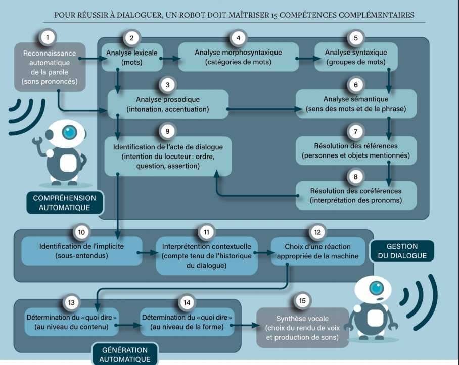

# PAr102-chatbot

GitLab du PAr 102 de l'année 2021-2022 visant à créer un Chatbot ou assistant conversationnel pour renseigner sur le programme de formation de l'école Centrale de Lyon


À la base, vous trouverez:
- dans le fichier `word2vec.py` le code pour fabriquer le Word2Vec sur les documents de scolarité (se trouvant dans le dossier `documents_scolarité`), dont les résultats des calculs (modèle Gensim, phrases lemmatisées et extraites, fichiers binaires des vecteurs et vocabulaire) se trouvent dans `word2vec_docs_scol_traités`. Si les dépendances sont satisfaites (Spacy, NLTK, sklearn, pandas, seaborn, gensim), une exécution s'occupe automatiquement de créer un word2vec des documents présents dans le git;
- dans le fichier `graphes-étude-sémantique.py` un code pour étudier la distribution sémantique des Word2Vec réalisés;
- dans le fichier `questions_scolarité.xlsx` l'ensemble d'entraînement pour le modèle QAnet;
- dans le fichier `question_answering_QAnet_création_dataset.ipynb` l'ensemble des codes pour créer le dataset de QAnet à partir de l'excel précédemment évoqué, ce code enregistre le dataset au format binaire avec la librairie `pickle` dans le fichier `questions_réponses_scol`;
- dans le fichier `question_answering_QAnet_entraînement.ipynb` le modèle QAnet.

# Installer TensorFlow
Ci-dessous, la méthode qui a servi à installer TensorFlow avec les versions compatibles de cudnn

```
conda install -c conda-forge python=3.9.9 # tf supporte pas 3.10
conda install -c conda-forge spyder
pip install tensorflow-gpu # il a mis la 2.7.0
pip install tensorflow # ??? (update non inutile)
conda install -c conda-forge cudnn # et a mis la 8.2.1.32 et cudatoolkit 11.5.0 en dependency
```
Correspondance des compatibilités de TensorFlow avec CUDA et cuDNN: https://www.tensorflow.org/install/source#gpu

Correspondance des compatibilités de TensorFlow avec le paquet `tensorflow-addons`: https://github.com/tensorflow/addons#python-op-compatility

[How to install Tensorflow 2.5 with CUDA 11.2 and CuDNN 8.1 for Windows 10](https://spltech.co.uk/how-to-install-tensorflow-2-5-with-cuda-11-2-and-cudnn-8-1-for-windows-10/)


## Ressources:
Cette liste fait suite à la suppression accidentelle du fichier contenant la liste des adresses consultées pendant le PAr lors de la réorganisation et le nettoyage du Git.

#### Adresses-clés:
- blog.paperspace.com, beau site aux tons sombres et violets qui reprenait des codes de la doc de tensorflow en expliquant un peu mieux, particulièrement [Neural Machine Translation with TensorFlow](https://blog.paperspace.com/neural-machine-translation-with-tensorflow/)
- machinelearningmastery.com
- tensorflow.org
- blog.keras.io
- kaggle.com
- course.spacy.io
- inria.github.io et ses MOOCS
- https://wiki.pathmind.com
- maelfabien.github.io/, afagarap.github.io (moindre mesure)
#### Thèmes
- positional encoding
- autoencoders
- attention mechanism
- machine translation
- word embedding (et réutiliser dans tensorflow ceux de Gensim)
- explications sur les différents types ce cellules LSTM, GRU et les sites qui faisaient l'inventaire des types de réseaux de neurones
- functional/sequential APIs
- word2vec et ses très, très nombreux tutoriels. Notamment celui avec les images illustratrices tableaux assez détaillés sympas en couleurs vives (je me rappelle de jaune...)
- les transformers
- Guides to attention mechanism
- Guides to categorical cross-entropy et losses etc
- la liste des papiers pertinents se trouve, *hopefully*, dans le rapport, notammelt **Attention Is All You Need**, **Bi-Directional attention flow for machine comprehension**, **XGBoost: A Scalable Tree Boosting System**, 
- toutes les comparaisons GPU VS CPU et l'usage de CUDA avec tensorflow
- tout ce qui traitait des expressions rationnelles et du prétraitement des textes en python
- les articles de recherche et de philosophie des sciences sur l'IA, dont le texte de Yann Le Cun (déplacé vers Intérêts récents), et l'autre texte qu'on avait eu en TD de socio


#### Derniers sites type tuto sauvées en *stand-by*

- ml-cheatsheet.readthedocs.io
- [Machine Learning Glossary](https://developers.google.com/machine-learning/glossary?hl=fr)
- [signification batch, etc sur stack](https://stackoverflow.com/questions/53514495/what-does-batch-repeat-and-shuffle-do-with-tensorflow-dataset)

- [End to End Question-Answering System Using NLP and SQuAD Dataset](https://www.analyticsvidhya.com/blog/2021/11/end-to-end-question-answering-system-using-nlp-and-squad-dataset/)

- [A Comprehensive Guide to Attention Mechanism in Deep Learning for Everyone](https://www.analyticsvidhya.com/blog/2019/11/comprehensive-guide-attention-mechanism-deep-learning/)

- [CuPy and Numba on the GPU](https://carpentries-incubator.github.io/gpu-speedups/01_CuPy_and_Numba_on_the_GPU/index.html)
- [Using your GPU with CuPy](https://carpentries-incubator.github.io/lesson-gpu-programming/02-cupy/index.html)
- [Word2vec from Scratch with Python and NumPy](https://nathanrooy.github.io/posts/2018-03-22/word2vec-from-scratch-with-python-and-numpy/) qui semble programmer toutes les équations originales du Word2Vec
- [The backpropagation algorithm for Word2Vec](http://www.claudiobellei.com/2018/01/06/backprop-word2vec/#multi-word-cbow) qui donne toutes les formules de Word2Vec bien précisément, l'une des sources les plus détaillées que j'ai pu rencontrer; ainsi que [Python implementation of Word2Vec](http://www.claudiobellei.com/2018/01/07/backprop-word2vec-python/) du même site


- [Word2Vec Tutorial - The Skip-Gram Model](http://mccormickml.com/2016/04/19/word2vec-tutorial-the-skip-gram-model/) et [Word2Vec Tutorial Part 2 - Negative Sampling](http://mccormickml.com/2017/01/11/word2vec-tutorial-part-2-negative-sampling/)
- [Building Autoencoders in Keras](https://blog.keras.io/building-autoencoders-in-keras.html)

- [Autoencoders with Keras, TensorFlow, and Deep Learning](https://pyimagesearch.com/2020/02/17/autoencoders-with-keras-tensorflow-and-deep-learning/)
- [Implementing an Autoencoder in TensorFlow 2.0](https://afagarap.github.io/2019/03/20/implementing-autoencoder-in-tensorflow-2.0.html)
- Une [présentation](https://www.cs.upc.edu/~padro/ahlt/2020/lectures/06-wordvectors.pdf) de Politechnique Milan sur la vectorisation des mots
- [Convertir les caractères Unicode en chaîne ASCII en Python](https://www.delftstack.com/fr/howto/python/python-unicode-to-string/)

- [Timo Denk's Blog : positional encoding explained TB++ avec formules](https://timodenk.com/blog/linear-relationships-in-the-transformers-positional-encoding/)

- [Positional Encoding: everything you need to know](Positional Encoding: Everything You Need to Know )
#### Kaggle, Keras, Tensorflow
- [A ten-minute introduction to sequence-to-sequence learning in Keras](https://blog.keras.io/a-ten-minute-introduction-to-sequence-to-sequence-learning-in-keras.html)
- [Coleridge - Huggingface Question Answering](https://www.kaggle.com/code/jamesmcguigan/coleridge-huggingface-question-answering/notebook)
- [Algorithmes de classification de texte](https://developers.google.com/machine-learning/guides/text-classification), notebook sur developers.google.com, qui explique l'état de l'art (avec diagrammes de décisions flow  charts etc)

#### machinelearning Mastery
- Handwritten Digit Recognition using Convolutional Neural Networks in Python with Keras
- How to Develop a CNN for MNIST Handwritten Digit Classification
- A Gentle Introduction to Cross-Entropy for Machine Learning
- A Gentle Introduction to Information Entropy
- A Gentle Introduction to Cross-Entropy for Machine Learning
- Gentle Introduction to the Adam Optimization Algorithm for Deep Learning
- A Gentle Introduction to LSTM Autoencoders
- Multi-Class Classification Tutorial with the Keras Deep Learning Library
- What is the Difference Between Test and Validation Datasets?
- How to Reshape Input Data for Long Short-Term Memory Networks in Keras
- Your First Deep Learning Project in Python with Keras Step-By-Step
- How to Visualize a Deep Learning Neural Network Model in Keras
- Adding A Custom Attention Layer To Recurrent Neural Network In Keras
- What is Teacher Forcing for Recurrent Neural Networks?
- How to Develop an Encoder-Decoder Model with Attention in Keras
- Difference Between Return Sequences and Return States for LSTMs in Keras
- How to Develop Word Embeddings in Python with Gensim
- How to Use Word Embedding Layers for Deep Learning with Keras
- How to Use the Keras Functional API for Deep Learning
- How to Make Predictions with Keras
- Data Preparation for Variable Length Input Sequences
- How to Configure the Learning Rate When Training Deep Learning Neural Networks
- How to Use the TimeDistributed Layer in Keras
- The Attention Mechanism from Scratch
- Dropout Regularization in Deep Learning Models With Keras
- How to Visualize Filters and Feature Maps in Convolutional Neural Networks

#### Towards Data Science
- Natural Language Processing — Dependency Parsing
- NLP 101: Word2Vec — Skip-gram and CBOWqui donne les références:
    * Lecture notes CS224D: Deep Learning for NLP Part-I
    * Lecture notes CS224D: Deep Learning for NLP Part-II
    * McCormick, C. (2016, April 19). Word2Vec Tutorial — The Skip-Gram Model.
- Learn Word2Vec by implementing it in tensorflow
- Embeddings with Word2Vec in non-NLP Contexts — Details
- Introduction to Data Visualization in Python | by Gilbert Tanner
- Comprehensive Overview of Random Variables, Random Processes, and Their Properties (Part 2) | by MANIE TADAYON
- Modeling Climate Change With Python | by Diego Salinas
- Canny Edge Detection Step by Step in Python — Computer Vision | by Sofiane Sahir
- Learn How to Write Markdown & LaTeX in The Jupyter Notebook | by Khelifi Ahmed Aziz
- PyTorch vs TensorFlow — spotting the difference | by Kirill Dubovikov
- Here’s How to Use CuPy to Make Numpy Over 10X Faster | by George Seif
- NLP 101: Word2Vec — Skip-gram and CBOW | by Ria Kulshrestha
- PDF Processing with Python. The way to extract text from your pdf… | by Ahmed Khemiri
- A Beginner’s Guide to Word Embedding with Gensim Word2Vec Model | by Zhi Li
- Natural Language Processing — Dependency Parsing | by Shivanee Jaiswal
- Installing Tensorflow with CUDA, cuDNN and GPU support on Windows 10 | by Dr. Joanne Kitson
- Learn Word2Vec by implementing it in tensorflow | by aneesh joshi
- Conversational AI Chatbot with Pretrained Transformers Using Pytorch | by Raymond Cheng
- Question Answering with Pretrained Transformers Using PyTorch | by Raymond Cheng
- Manage your Python Virtual Environment with Conda | by June Tao Ching
- Visualising high-dimensional datasets using PCA and t-SNE in Python | by Luuk Derksen
- Explaining K-Means Clustering. Comparing PCA and t-SNE dimensionality… | by Kamil Mysiak
- Building a Question-Answering System from Scratch— Part 1 | by Alvira Swalin
- Seq2Seq model in TensorFlow. In this project, I am going to build… | by Park Chansung
- Skip-Gram: NLP context words prediction algorithm | by Sanket Doshi
- Embeddings with Word2Vec in non-NLP Contexts — Details | by Bora Turan
- Implementing an Autoencoder in TensorFlow 2.0 | by Abien Fred Agarap
- TF IDF | TFIDF Python Example. An example of how to implement TFIDF… | by Cory Maklin
- Illustrated Guide to LSTM’s and GRU’s: A step by step explanation | by Michael Phi
- LSTM Autoencoder for Anomaly Detection | by Brent Larzalere
- Machine Learning — Word Embedding & Sentiment Classification using Keras | by Javaid Nabi
- How to implement Seq2Seq LSTM Model in Keras | by Akira Takezawa
- Attention in Deep Networks with Keras | by Thushan Ganegedara
- Text Summarization from scratch using Encoder-Decoder network with Attention in Keras | by Varun Saravanan
- Implementing neural machine translation using keras | by Renu Khandelwal
- Implementing QANet (Question Answering Network) with CNNs and self attentions | by Min Sang Kim
- Deep Convolutional Neural Networks | by Pablo Ruiz
- Attention is all you need: Discovering the Transformer paper | by Eduardo Muñoz
- How to create a sequential model in Keras for R | by Pablo Casas
- Transformers Explained Visually (Part 3): Multi-head Attention, deep dive | by Ketan Doshi
- Creating Word Embeddings: Coding the Word2Vec Algorithm in Python using Deep Learning | by Eligijus Bujokas
- Word2vec from Scratch with NumPy. How to implement a Word2vec model with… | by Ivan Chen
- Time Series of Price Anomaly Detection with LSTM | by Susan Li
- The Complete Hands-On Machine Learning Crash Course | by Marco Peixeiro
- The theory you need to know before you start an NLP project | by Arne Laponin
- Introduction to NLP Deep Learning Theories | by Jiahui Wang
- Intuitive Understanding of Attention Mechanism in Deep Learning | by Harshall Lamba
- Master Positional Encoding: Part I | by Jonathan Kernes
- How VSCode has leaped forward as Jupyter Notebook Editor | by Tino T. Herden
- PCA using Python (scikit-learn) | by Michael Galarnyk
- Feature selection — Correlation and P-value | by Vishal R
- DALL·E 2, Explained: The Promise and Limitations of a Revolutionary AI | by Alberto Romero
- Neural Machine Translation: Inner Workings, Seq2Seq, and Transformers


# Idées (très personnelles et non formalisées) de poursuite pour l'étude du langage en ML
Cetre réflexion, je me la suis faite en étudiant l'allemand.
Trouver un type d'apprentissage non supervisé basé en partie sur des réseaux type transformers classiques au regard de l'état de l'art en traduction, et en partie sur l'analyse morphosyntaxique en coupant les mots (particulièrement vrai pour certains langages comme l'allemand ou le slovène qui change le sens de mots en ajoutant devant ou derrière des petits préxixes ou suffixes et qui modifient le sens, soit en prenant d'autres mots (langue agglutinante allemand) soit aussi comme en français, en prenant des racines et en déclinant différentes catégories de mots associés comme adjectif, nom, averbe etc)).
Ainsi, on pourrait imaginer un système qui plutôt que de prendre en compte simplement chaque mot indépendant dans le corpus et en apprenant sa signification juste par exposition dans le réseau de neurones, mémorise et apprend bien plus vite, grâce à un humain, en regardant comment il est construit. On pourrait ensuite faire exprimer au système (réseau, algo) ce qu'il a appris en exhibant des mécanismes regardant ces règles. En particulier, au niveau des déclinaisons en allemand avec les tableaux pour les déterminants et les adjectifs, lui faire recracher les tableaux ce qui serait un pas majeur vers l'explicabilité de tels sytèmes.



